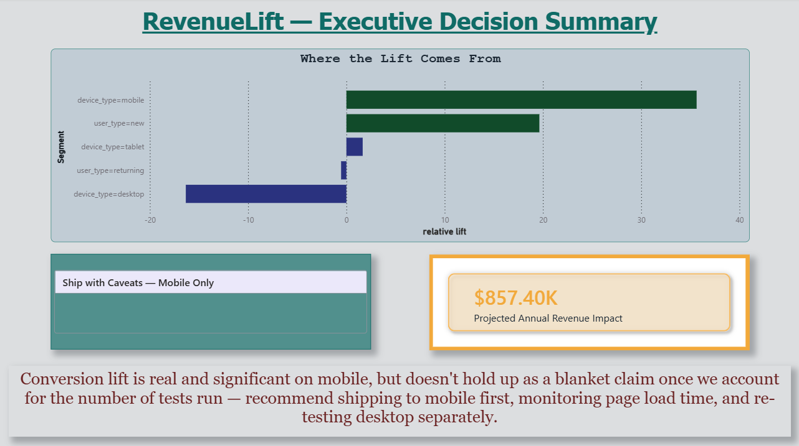
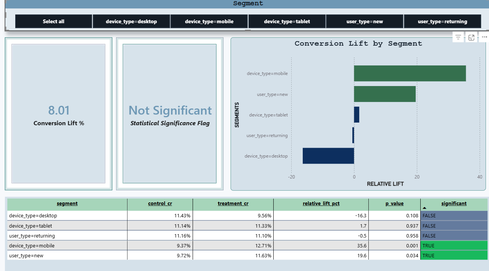
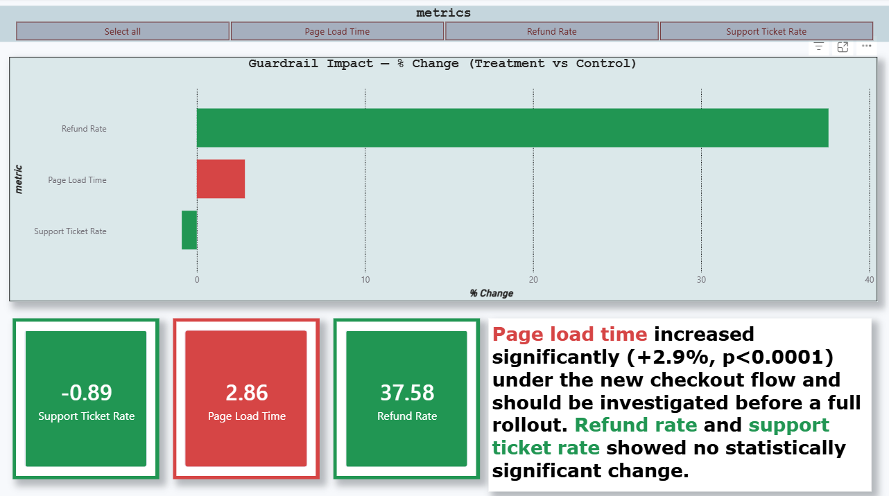

# RevenueLift — A/B Test Analysis & Business Decision Platform

An end-to-end A/B test analysis project combining rigorous statistical
testing (Python/SQL) with a business-facing decision report (Power BI).

## The Experiment

A simulated e-commerce checkout experiment: does a new checkout flow
(Treatment) improve conversion rate over the current checkout (Control)?

## Key Finding

The **aggregate** conversion lift looked promising (raw p=0.015) but did
**not** survive a Benjamini-Hochberg multiple-testing correction across
the 10 significance tests run in this analysis (adjusted p=0.050) — a
result that would have been reported as a clean win is, in fact, a
statistical near-miss once properly corrected.

However, the **mobile segment** effect is genuinely robust: +35.6% relative
lift, adjusted p=0.003, and mobile represents the majority of traffic.

**Recommendation: Ship with Caveats — Mobile Only.** Roll out to mobile,
re-test desktop independently, and monitor page load time, which
regressed significantly (+2.9%, p<0.0001) under the new flow.

Projected additional annual revenue (mobile-only scope): **~$857,401**.

## Why This Project Exists

Most beginner A/B testing projects stop at "is the p-value under 0.05?"
This project goes further:
- **Power analysis** before generating any data, to determine a proper sample size
- **Guardrail metrics** (refund rate, support tickets, page load time) checked alongside the primary metric
- **Segment analysis** across device type and user type, with an explicit Simpson's Paradox check
- **Multiple testing correction** — which changed the actual conclusion of this analysis
- A **revenue-impact projection** with explicitly documented assumptions, not an invented number

## Tech Stack

- **Python** (pandas, scipy, statsmodels) — data generation, significance testing, power analysis
- **DuckDB** — embedded SQL database for sessions/orders data
- **pytest** — validation of statistical functions against known reference values
- **Power BI** (DAX, Power Query) — business-facing decision report

## Report Pages

### Executive Summary


The headline recommendation, projected revenue impact, and a supporting
chart showing where the conversion lift actually comes from.

### Segment Breakdown


Interactive segment-level significance testing — filter by device type or
user type to see conversion lift and significance update dynamically.

### Guardrail Metrics


Refund rate, support ticket rate, and page load time, color-coded to
immediately flag which guardrails held and which regressed.

## Repository Structure

```
revenuelift/
├── analysis/           # Python scripts — data generation through decision engine
├── data/                # DuckDB database and generated CSVs
├── tests/               # pytest suite validating statistical functions
├── docs/                # Design docs, methodology, results, screenshots
├── powerbi/             # RevenueLift.pbix
└── requirements.txt
```

## Running the Analysis

```bash
python analysis/power_analysis.py
python analysis/generate_experiment_data.py
python analysis/significance_testing.py
python analysis/guardrail_checks.py
python analysis/segment_analysis.py
python analysis/multiple_testing_correction.py
python analysis/decision_engine.py
pytest tests/ -v
```

## Methodology

See [`docs/experiment_design.md`](docs/experiment_design.md) for the
pre-registered hypothesis and success criteria, and
[`docs/statistical_methodology.md`](docs/statistical_methodology.md) for
full details on every statistical method used.
